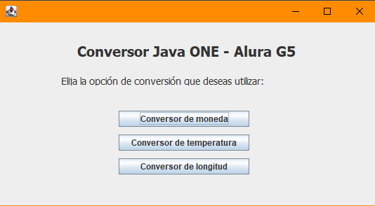
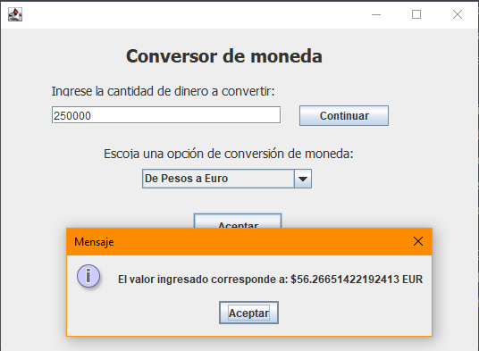
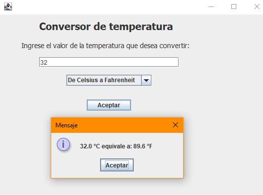

# Coin_conversor

### **Descripción**

Aplicación Java que permite convertir divisas de algunos países y también convertir unidades de temperatura. Se utilizó la librería *Java.swing* para la creación de la interfaz gráfica. Proyecto que cumple con los requisitos del *Challenge Oracle-One y Alura Latam*, pero que se tiene pensado mejorar a futuro conforme aprenda más el lenguaje **Java**. 

- Para la conversión de moneda se utilizó valores estáticos, a futuro espero poder implementar una API con valores en tiempo real y poder incluir las divisas de otros países. 
- Para la conversión de temperatura se utilizó las escalas de Temperatura de Celsius, Kelvin y Fahrenheit.
- La tercera opción *Conversión de longitud* está en proceso de desarrollo, más como parte de un desafio personal. 

### **Ventana principal**

*Java.swing*

### **Interfaz conversor de moneda**

*Java.swing*

### **Interfaz conversor de temperatura**

*Java.swing*

# Coin_conversor - logro obtenido

